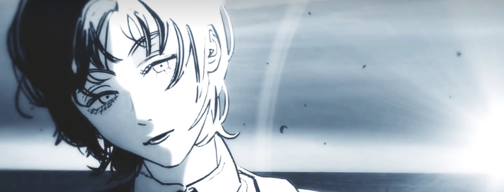

    
     
    

    

    
 

*"Au milieu de l’hiver, j’apprenais enfin qu’il y avait en moi un été invincible." ― Albert Camus*

Personal Interests
===

**I am a Cinephile**, enjoying watching films spanning from the 1970s to present day. When I'm not immersed in mathematics, I spend the majority of my free time selecting and watching movies. My all-time favorite director is *Karwei Wong*, who first inspired my love for movies. In fact, I have a dream to be a director. You can see my *Douban* [here](https://www.douban.com/people/210616758/subject_doulists/movie)

The following are my TOP 10:

- *버닝(Burning), directed by 이창동*

- *スワロウテイル(Swallowtail Butterfly), directed by いわい しゅんじ*

- *The Curious Case of Benjamin Button, directed by David Fincher*

- *Thirst, directed by Park Chan-wook*

- *Fight Club, directed by David Fincher*

- *Days of Being Wild, directed by Karwei Wong*

- *Fallen Angels, directed by Karwei Wong*

- *Interstellar, directed by Christopher Nolan*

- *신세계(New World), directed by 박훈정*

- *Being John Malkovich, directed by Spike Jonze*

- *Drive My Car, directed by Ryusuke Hamaguchi*

**I also enjoy watching series**, although it can be challenging to find high-quality ones. My top two favorite series are(which I consider to be PERFECT):

- *Breaking Bad* 

- *Better Call Saul*

When it comes to Anime, I love *Rick and Morty*, *Futurama*, *Attack on Titan*, and *Neon Genesis Evangelion* (these are pretty much all the anime I have watched).

>The character in *Attack on Titan* whom I admire most is *Erwin Smith*. I believe that we are of the same kind of people, both agree a saying, *"朝闻道，夕死可矣。"*

Additionally, I have a great appreciation for the works of *Shinichirō Watanabe (渡边信一郎)* , a dual director of *Karwei Wong* in Japaness Anime.

**I appreciate the works from *Tatsuki Fujimoto (藤本树)* very much although I don't read manga usually.** The following are the rank of some of his works depending on my preference: 1. *Goodbye, Eri* 2. *Look Back* 3. *Fire punch* 4. *Chainsaw man*
 
**I'm also a music lover.** I'm obsessed with classical music. I loce *Johann Sebastian Bach* and appreciate the operas from *Richard Wager* (I knew he from a serie: *Inspector Morse* actually). I also enjor some pop music, like the works from *Jay Zhou* and *Stefanie Sun*. I am also astonished with the appearance of *AI-Stefanie Sun*. Sometimes, I also enjor some works from Japanese female idol groups, like *Nogizaka46*, *Sakurazaka46*. BTW I appreciate the taste of Director *James Gunn* on rock music in his works very much. 

**My favortie writter is *William Faulkner*.** (Sadly speaking, I spend less time on reading literature nowadays.) I once also got addicted with the novels from *Yan Mo* when I was in middle school.

**I admire the Philosopher *Friedrich Nietzsche* very much.** I appreciate his thinking on nihilism and the famous statement: *God was dead*.

My MBTI
===

It seems that I'm an **INTJ-A/INTJ-T**.
>**Mind**: 82% Introverted **Energy**: 77% Intuitiive **Nature**: 68% Thinking **Tactics**: 64% Judging **Identity**: 60% Assertive 

>People like to treat their daily lives as a theatrical stage, playing the roles that society expects of them in certain situations, as posited by Erving Goffmana, one sociologist.

MISC
===

***Mein Glück***

*--Friedrich Nietzsche*

*"Seit ich des Suchens müde ward,*

*“自从厌倦于追寻，*

*Erlernte ich das Finden.*

*我已学会一觅即中。*

*Seit mir ein Wind hielt Widerpart,*

*自从一股逆风袭来，*

*Segl' ich mit allen Winden."*
 
*我已能抵御八面来风架舟而行。”*

