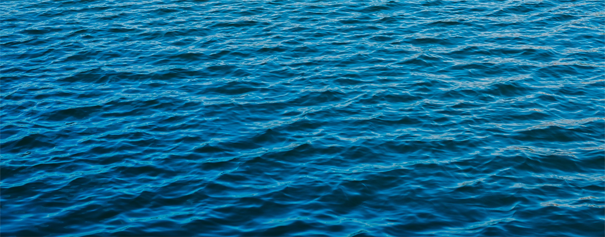
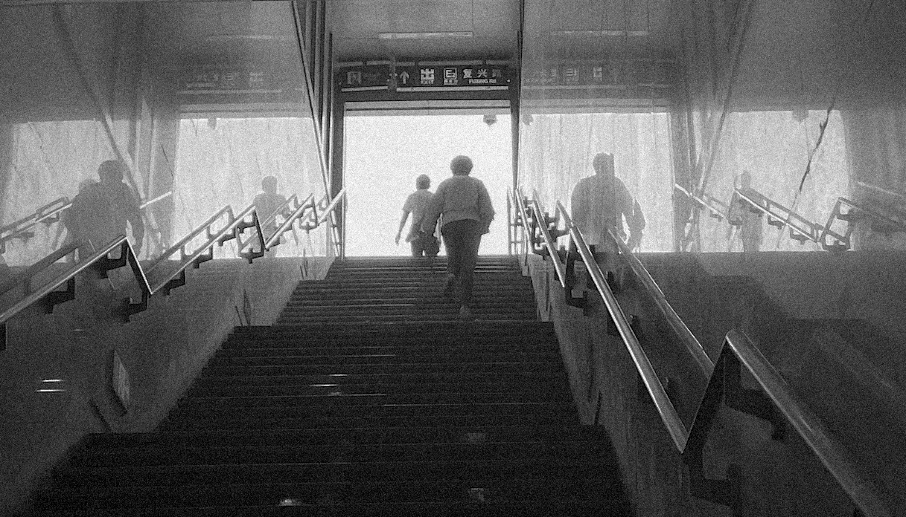
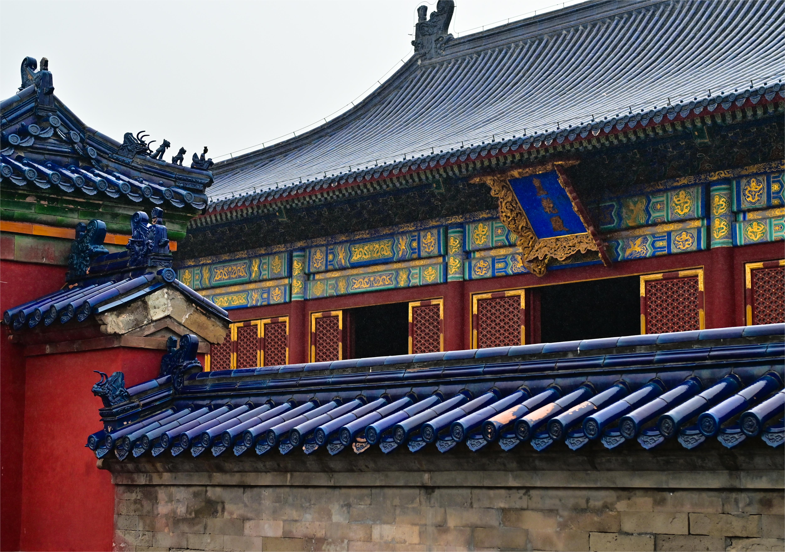

    
     
    

        Sometimes I am an ocean while sometimes I am a lake
    

    
 

*"My search for truth is finished at last, I’m going home." ― Zima Blue*

Photographs
===

I am an amateur photographer, still learning photographic art. As a saying in one film *A One and a Two* goes, *we can only see the half of our world,* I like taking photos of something that most people can't see. I will share my works on *[500px](https://500px.com.cn/community/index.html)*, you can see them [here](https://500px.com.cn/runzheyang).

Selected Works
===

>"Which of my photographs is my favorite? The one I am going to take tomorrow." ― Imogen Cunnigham

    
     
    

        Tree
    

    
 

    
     
    

        The lonely SOS screams silently
    

    
 

    
     
    

        Moon in river
    

    
 

    
     
    

        Illumination of street lamp
    

    
 

    
     
    

        Colors fade when roles change
    

    
 

    
     
    

        Mirror reflection as the complement of sky
    

    
 

    
     
    

        An eye filled with bamboos with a sense of zen
    

    
 

    
     
    

        A way to renascence
    

    
 

    
     
    

        A prisoner bathes in sunshine
    

    
 

    
     
    

        An oil painting on canvas of lake
    

    
 

    
     
    

        Suzhou
    

    
 

    
     
    

        Nanjing
    

    
 

    
     
    

        Beijing
    

    
 

    
     
    

        Beijing
    

    
 

    
     
    

        Nanjing
    

    
 

