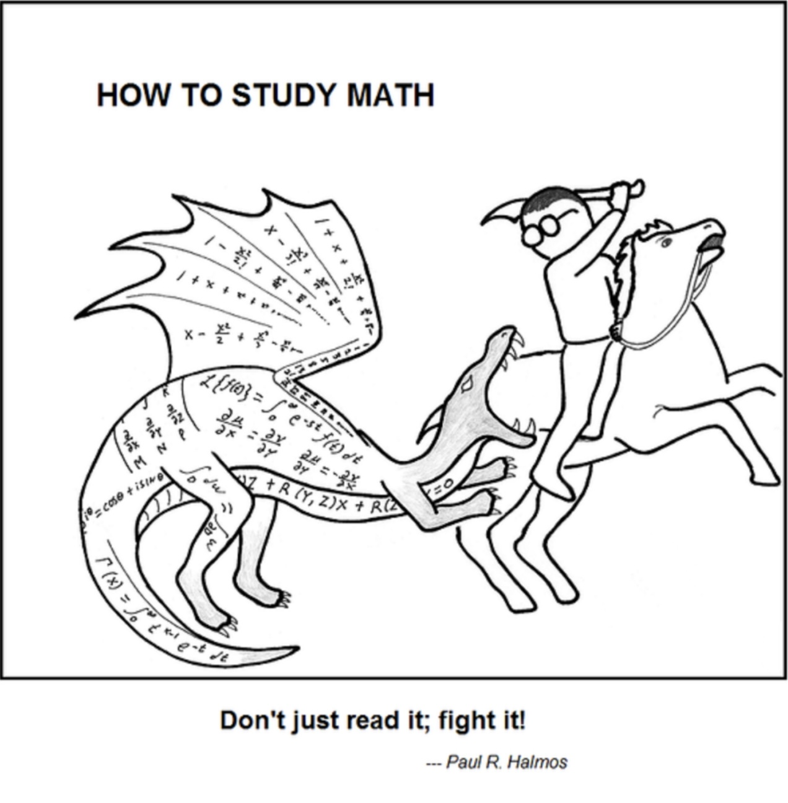

    
     
    

    

    
 

 

*“要多想。” ― 《三体》*

😵 *Interesting Quizzes*
===

Q1: For two sequence of r.v.'s *(Xn)* and *(Yn)* independent in a same probability space. If *Xn→X,Yn→Y* both in distribution. Do you think *Xn+Yn→X+Y* in distribution?
   
   >Think it carefully. You can modify the statement and make it more tricky.
    
Q2: How to prove any two families of o.n.b of one Hilbert space have the same cardinality?
   >You will find sth amazing in definition of "SUM".

Q3: Do you really think *p(θ∈(a,b))∈{0,1}* for some parameter *θ*?
   >This is an essential difference between a Bayesian and a Frequenist. I have to say: I am totally a Bayesian. 

Q4: For a n.v.s *E. F* is a close subspace, is there a *m* in *F* st. *d(x,F)=d(x,m)*? 
   >There's a sufficient and necessary condition for its holding.

Q5: How to construct a r.v. on one probability space that it has the desired distribution?
   >You can search for a THM called Skorokhod's Representation THM, which is one of my most favourite THM in Probability. Read the proof and find sth amazing.

Q6: Do you think one transition function can correspond one CTMC? What's about one generator and one CTMC?
   >It first amazes me because it's a simple example that satisfies strong Markov property but not a Feller process. (Actually, Feller property is a stronger property     than merely strong Markov) If you are interested in this question, you can search for a process called Blackwell process.

Q7: What's the dual space of *R^∞* equipped with box topology?
   >Can you recall the definition of dual space? You can think it algebracally rather than analysisly.(hint: search for concepts: inductive limit and projective limit)

 

