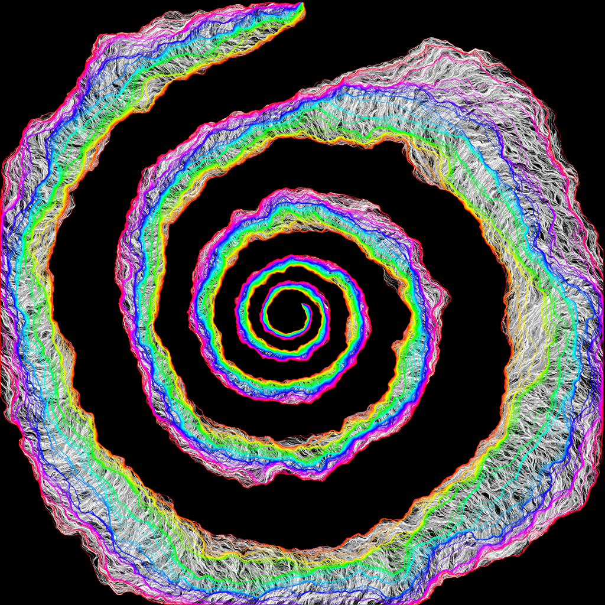

    
     
    

        A variant of SLE(64) generated as a light cone of Gaussian free field flow lines
    

    
 

*“Wir müssen wissen,wir werden wissen.” ― David Hilbert*

Research Interests
===

1. Statistical Physics:
   - Percolation
   - Gaussian Free Fields and Interface Models
   - Random Walks and Random Interlacements
   - Schramm-Loewner Evolutions
2. Stochastic Analysis and SPDEs

Research Projects
===

***1.Lower Bound for Disconnection of Loop Percolations***

Supervisor: *Prof. [Maximilian Nitzschner](https://cims.nyu.edu/~mn2977)*

*May 2023 --- Now* (Remote)

Pubilications and Preprints
===
NULL
